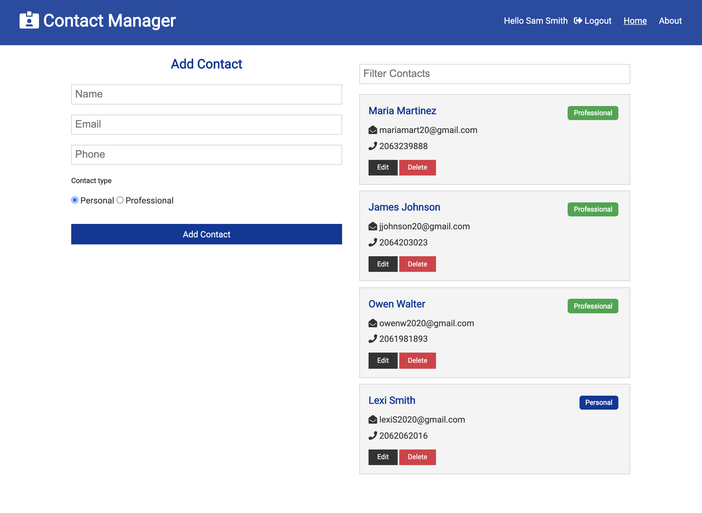
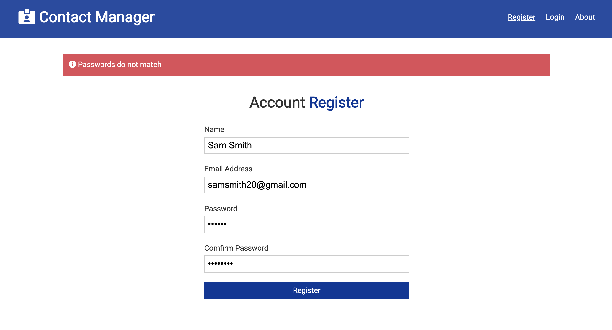

# Contact manager app built with MongoDB, Express, React, and Node.

## Front end built with React functional components and hooks. State management with redux and thunk. Backend authentication with jsonwebtoken, bcryptjs, and express validator. Deployed with Heroku.

### Core features:
1. User is able register and login to get authenticated
2. Authenticated user is able to go to dashboard
3. Authenticated user is able to add personal and professional contacts
4. Authenticated user is able to filter through their contacts

[Deployed version to play around](https://calm-ravine-79743.herokuapp.com/register)

#### Previews:

